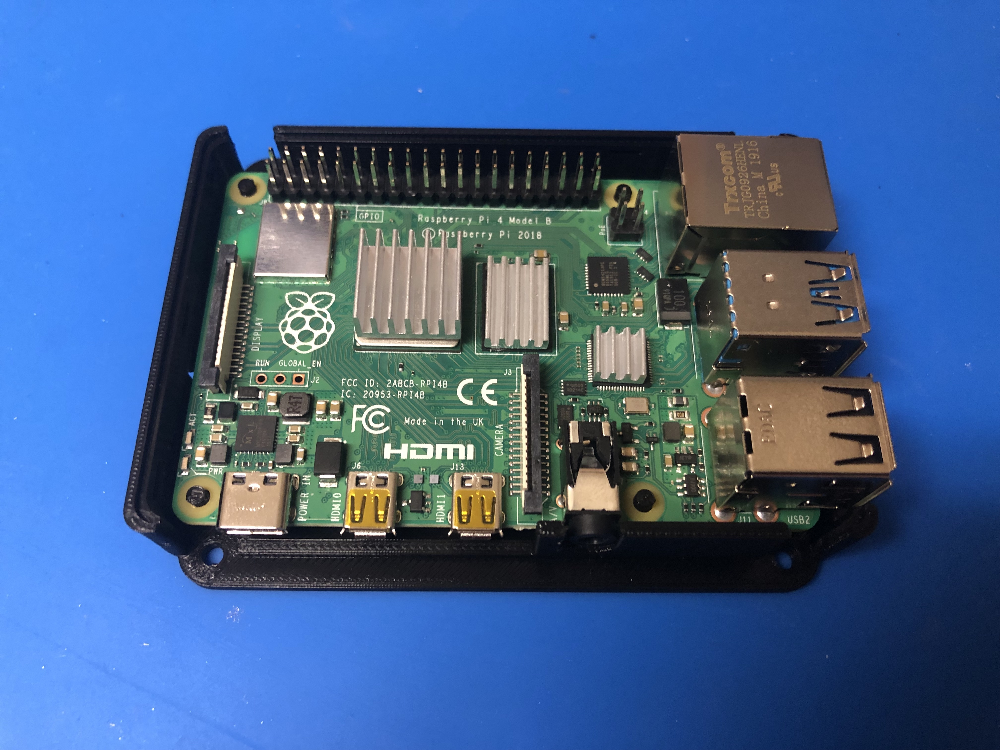

 

# Raspberry Pi 4 SSD Case

# Summary
I created this case so I could easily attach an SSD to my Raspberry Pi 4. It's perfect for using the Raspberry Pi as a media center, a server, or a desktop PC.

You will need M3 mounting screws to attach the SSD to the case. (I found some of these screws included with my PC case.)

I created this case by combining and modifying the remixed sources in Tinkercad. I filled in some of the cutouts on the top of the case, and the unnecessary ventilation on the sides. I also cut out ventilation in the bottom of the case and room for the M3 screws. I had to also cut out some space for the Micro HDMI cables.

I really wanted to find a case like this here on Thingiverse but since I couldn't find a case that had what I needed, I decided to create the exact case myself.

I hope that this case will work well for anyone who needs it. I highly recommend it.

If you're interested in modifying the case you can get started with the model on Tinkercad:
<https://www.tinkercad.com/things/5JPkop3FIWC>

Finally, if you want to know the exact SSD and SATA to USB connector I'm using, here are the links:

Samsung SSD 860 EVO 1TB 2.5 Inch SATA III Internal SSD (MZ-76E1T0B/AM)
<https://www.amazon.com/gp/product/B078DPCY3T>

StarTech.com SATA to USB Cable - USB 3.0 to 2.5” SATA III Hard Drive Adapter - External Converter for SSD/HDD Data Transfer (USB3S2SAT3CB)
<https://www.amazon.com/gp/product/B00HJZJI84>

# Download

You can download the latest version of the models on the releases page: <https://github.com/nrobinson2000/pi4-ssd-case/releases>

# Image Slideshow

<blockquote class="imgur-embed-pub" lang="en" data-id="a/RhaiFXj" data-context="false" ><a href="//imgur.com/a/RhaiFXj">Raspberry Pi 4 SSD Case</a></blockquote>

